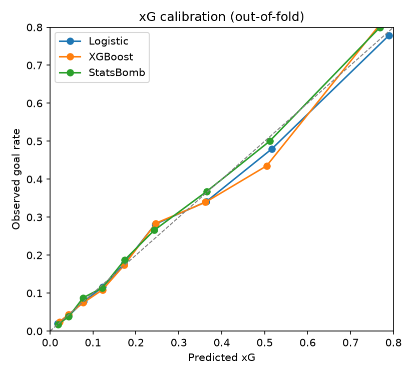
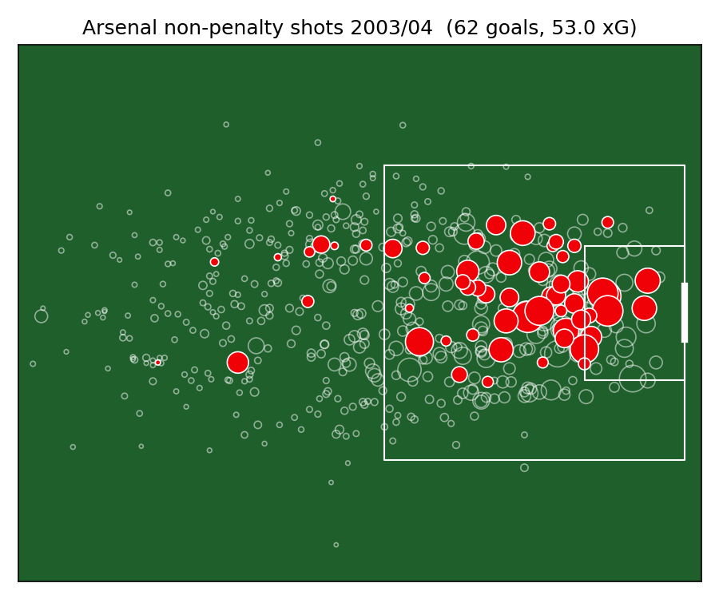

# Arsenal Under the Hood

**Match prediction and performance diagnosis in the Premier League, 2000/01 to 2025/26.**

Two questions:

1. Can a model built from public data beat the betting market at predicting Premier League results?
2. What does it say about *why* Arsenal over- or under-performed in each managerial era?


## Why this project is more than a notebook

| Piece | What it does |
|---|---|
| Two data sources at different granularity | 9,800+ matches (football-data.co.uk) plus ~10,800 individual shots with coordinates (StatsBomb), joined in SQLite |
| SQL modelling layer | `team_matches`, `season_table` and `arsenal_seasons` views ([sql/02_views.sql](sql/02_views.sql)) |
| Custom Elo | Home advantage, margin-of-victory multiplier, between-season regression to the mean, promoted clubs seeded from relegated ones; parameters tuned on 2001-2005 only |
| xG model from raw shots | Shot geometry plus context, logistic regression vs XGBoost, cross-validated by match, benchmarked against StatsBomb's own xG |
| Leakage-free ML | Rolling features use only previous matches; walk-forward training season by season; unit tests enforce it ([tests/test_no_leakage.py](tests/test_no_leakage.py)) |
| Market benchmark | Bookmaker margin removed (power method), log loss / Brier / RPS, bootstrap CIs, stacking test, betting simulation with ROI confidence intervals |
| Diagnosis | Arsenal actual vs expected points by era, decomposed into shot volume, finishing, shot suppression and shot stopping |
| Dashboard | Streamlit app over the SQLite database |

## Results

### xG model (StatsBomb Open Data, 10,837 shots, 5-fold CV grouped by match)

| Model | Log loss | Brier | AUC |
|---|---|---|---|
| **Logistic regression (ours)** | **0.2545** | **0.0717** | **0.811** |
| XGBoost (ours, tuned) | 0.2645 | 0.0747 | 0.792 |
| StatsBomb xG (industry benchmark) | 0.2513 | 0.0703 | 0.816 |
| Baseline (league conversion rate) | 0.3247 | 0.0899 | 0.500 |

A well-specified logistic regression on shot geometry gets within about 1.3% (log loss) of StatsBomb's commercial model, and it **beats XGBoost**. With ~10k shots the trees overfit even when shallow and heavily regularised. The pipeline picks whichever model wins out-of-fold.

| Arsenal | xG for / game | Goals / game | xG against / game | Conceded / game |
|---|---|---|---|---|
| 2003/04 (Invincibles) | 1.52 | 1.92 | 0.83 | 0.68 |
| 2015/16 | 1.79 | 1.71 | 0.91 | 0.95 |

The Invincibles scored about 15 more goals than their chances were worth and conceded about 5 fewer. The 2015/16 side actually created *more* (1.79 xG a game) but finished below expectation. That season they came 2nd, 10 points behind Leicester.

 

### Model vs market, and Arsenal by era

These are generated by `python run_all.py` into [reports/arsenal_findings.md](reports/arsenal_findings.md), along with the charts below. After your first run, paste the headline numbers here.

## Data sources and credits

- **[football-data.co.uk](https://www.football-data.co.uk/englandm.php)**: Premier League results, match statistics and bookmaker odds (Bet365, Pinnacle, William Hill), 2000/01 to 2025/26. Data courtesy of football-data.co.uk.
- **[StatsBomb Open Data](https://github.com/statsbomb/open-data)**: event data used for the xG model. Premier League coverage is 2015/16 (all 380 matches) and 2003/04 (Arsenal's 38 matches only). Data provided by StatsBomb.

  

No data in this project is synthetic. Raw data is downloaded by the scripts and not committed.

## How to run

```bash
python -m venv .venv && source .venv/bin/activate   # Windows: .venv\Scripts\activate
pip install -r requirements.txt
python run_all.py                    # downloads data, runs Steps 1-8 (about 10 min the first time)
pytest                               # unit tests, including the leakage tests
streamlit run app/streamlit_app.py   # dashboard
```

Run everything from the repo root.

## Pipeline

| Step | Script | Output |
|---|---|---|
| 1. Ingest | `src/download.py`, `src/build_db.py`, `src/validate.py`, `src/statsbomb_check.py` | `matches` table, validation report |
| 2. Clean + model layer | `src/transform.py`, `sql/02_views.sql` | `team_matches`, `season_table`, `arsenal_seasons` |
| 3. Elo | `src/elo.py` | `elo`, `elo_season_end`, `elo_params` |
| 4. xG | `src/statsbomb_shots.py`, `src/xg.py` | `xg_metrics`, `match_xg`, shot maps |
| 5. Features | `src/features.py` | `features` (81 columns, all pre-match) |
| 6. Models | `src/train.py` | `predictions`, `model_metrics` |
| 7. Market | `src/market.py` | `market_metrics`, `market_gaps`, `betting_results` |
| 8. Diagnosis + app | `src/arsenal.py`, `app/streamlit_app.py` | `arsenal_season_diag`, `arsenal_era_summary`, findings report |

## Method notes

- **Walk-forward evaluation.** For each season from 2005/06, models train on every earlier season (2000/01 is Elo burn-in) and predict that season blind. There's no random train/test split.
- **Removing the bookmaker margin.** Raw 1/odds sum to more than 1. The power method (`p_i = (1/o_i)^k`, with k solved so the probabilities sum to 1) corrects the favourite-longshot bias better than simple normalisation. Both are reported.
- **Is the gap real?** Differences in log loss come with a bootstrap 95% CI. A model only "beats the market" if the whole interval is below zero.
- **Stacking test.** A walk-forward logistic regression on `[log p_market, log p_model]` tells you whether the model adds information the market hasn't already priced in.
- **Diagnosis z-scores** are computed against the rest of the league in the same season, so eras with different scoring environments can be compared.

## Limitations

- football-data odds are pre-match, not always closing odds, so beating them is easier than beating the closing line.
- Rest days only count league matches. Cup and European fixtures aren't in the data.
- StatsBomb Premier League coverage is two seasons, so xG explains those seasons, not every era.
- Era labels are by date, and interim spells are folded into the neighbouring era.

## Repo layout

```
app/              Streamlit dashboard
data/raw/         downloaded data (git-ignored)
data/processed/   epl.db and derived files (git-ignored, except small CSVs)
models/           saved models (git-ignored)
reports/          findings report + figures
sql/              views and validation queries
src/              pipeline, one script per step
tests/            pytest suite
run_all.py        runs the full pipeline
```
