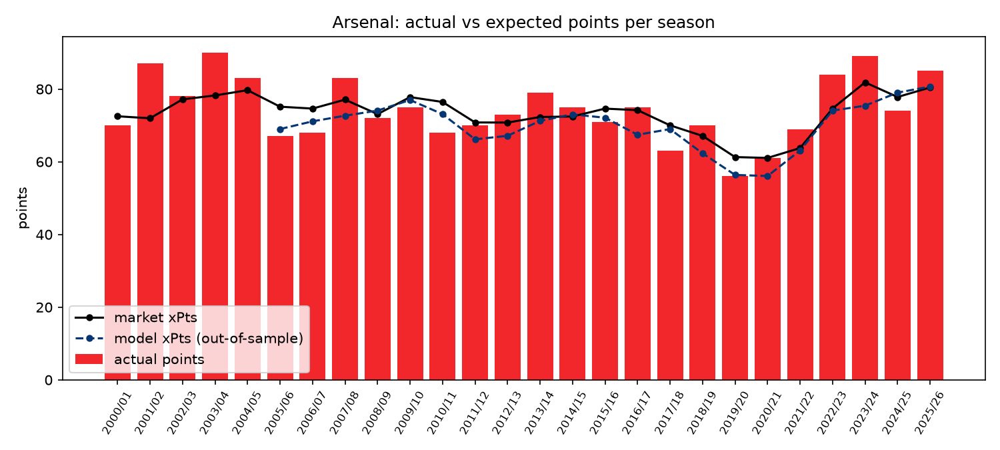
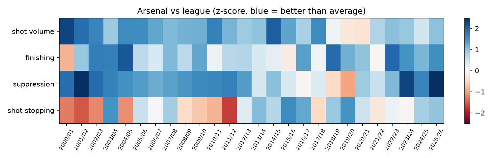
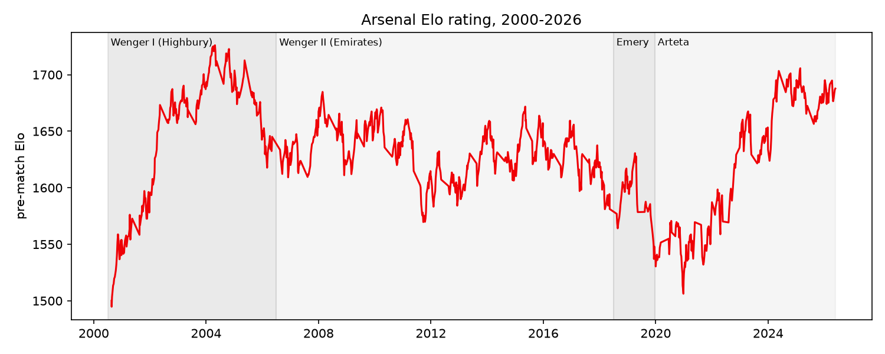

# Findings (auto-generated by `src/arsenal.py`)

Numbers here are regenerated on every run of `python run_all.py`.

## 1. Can a model beat the betting market?

| model                        | sample     |    n |   log_loss |   brier |    rps |   accuracy |
|:-----------------------------|:-----------|-----:|-----------:|--------:|-------:|-----------:|
| market_b365_power            | common     | 7980 |     0.9585 |  0.5685 | 0.1936 |     0.5477 |
| market_b365_proportional     | common     | 7980 |     0.959  |  0.5688 | 0.1938 |     0.5477 |
| elo_logit                    | common     | 7980 |     0.9732 |  0.5783 | 0.1981 |     0.5366 |
| xgb                          | common     | 7980 |     0.9764 |  0.5802 | 0.1984 |     0.5358 |
| full_logit                   | common     | 7980 |     0.9773 |  0.5807 | 0.1985 |     0.5356 |
| base_rates                   | common     | 7980 |     1.0643 |  0.643  | 0.2294 |     0.4556 |
| market_pinnacle_power        | own subset | 5150 |     0.9552 |  0.5652 | 0.1939 |     0.5515 |
| market_pinnacle_proportional | own subset | 5150 |     0.9553 |  0.5654 | 0.1939 |     0.5515 |
| stacked                      | own subset | 7220 |     0.962  |  0.5701 | 0.1941 |     0.5456 |

Log-loss gap vs market (negative = model better), 95% bootstrap CI:

| model      | vs                    |    n |   mean_logloss_gap |   ci_low |   ci_high | verdict       |
|:-----------|:----------------------|-----:|-------------------:|---------:|----------:|:--------------|
| xgb        | market_b365_power     | 7980 |             0.0179 |   0.0141 |    0.022  | market better |
| full_logit | market_b365_power     | 7980 |             0.0188 |   0.0146 |    0.0234 | market better |
| elo_logit  | market_b365_power     | 7980 |             0.0147 |   0.011  |    0.0183 | market better |
| stacked    | market_b365_power     | 7220 |             0.0029 |   0.0009 |    0.0048 | market better |
| xgb        | market_pinnacle_power | 5150 |             0.0194 |   0.0146 |    0.0241 | market better |
| full_logit | market_pinnacle_power | 5150 |             0.0186 |   0.0136 |    0.0237 | market better |
| elo_logit  | market_pinnacle_power | 5150 |             0.0179 |   0.0132 |    0.0228 | market better |
| stacked    | market_pinnacle_power | 5150 |             0.0026 |   0.0009 |    0.0043 | market better |

Flat-stake betting simulation at Bet365 prices:

| model   |   min_edge |   bets |   profit_units |    roi |   roi_ci_low |   roi_ci_high |
|:--------|-----------:|-------:|---------------:|-------:|-------------:|--------------:|
| xgb     |       0    |   9108 |        -830.15 | -0.091 |       -0.129 |        -0.052 |
| xgb     |       0.02 |   8015 |        -698.8  | -0.087 |       -0.127 |        -0.045 |
| xgb     |       0.05 |   6624 |        -613.44 | -0.093 |       -0.138 |        -0.049 |
| xgb     |       0.1  |   4857 |        -452.52 | -0.093 |       -0.153 |        -0.029 |
| xgb     |       0.15 |   3637 |        -344.81 | -0.095 |       -0.165 |        -0.018 |

## 2. Arsenal: points vs expectation by era

| era                  |   matches |   ppg |   xppg_mkt |   over_per_38 |   z_shot_volume |   z_finishing |   z_suppression |   z_shot_stopping |
|:---------------------|----------:|------:|-----------:|--------------:|----------------:|--------------:|----------------:|------------------:|
| Wenger I (Highbury)  |       228 |  2.08 |       2    |          3.05 |            1.65 |          1.05 |            1.84 |             -0.52 |
| Wenger II (Emirates) |       456 |  1.91 |       1.94 |         -1.02 |            1.27 |          0.57 |            1.04 |              0.13 |
| Emery                |        55 |  1.67 |       1.75 |         -3.09 |            0.12 |          1.92 |           -0.48 |              0.92 |
| Arteta               |       249 |  1.99 |       1.89 |          3.74 |            0.52 |          1.19 |            1.19 |              0.52 |

Biggest over-performance: **2001/02** (87 pts vs 72.0 market xPts). Biggest under-performance: **2010/11** (68 pts vs 76.4).

## 3. Season-by-season diagnosis

|   season | era                  |   position |   pts |   xpts_mkt |   over_mkt |   z_shot_volume |   z_finishing |   z_suppression |   z_shot_stopping |
|---------:|:---------------------|-----------:|------:|-----------:|-----------:|----------------:|--------------:|----------------:|------------------:|
|     0001 | Wenger I (Highbury)  |          2 |    70 |      72.51 |      -2.51 |            2.3  |         -0.88 |            1.89 |             -1.28 |
|     0102 | Wenger I (Highbury)  |          1 |    87 |      71.96 |      15.04 |            1.9  |          0.95 |            2.66 |             -1.55 |
|     0203 | Wenger I (Highbury)  |          2 |    78 |      77.16 |       0.84 |            1.65 |          1.72 |            1.92 |             -1.2  |
|     0304 | Wenger I (Highbury)  |          1 |    90 |      78.24 |      11.76 |            0.91 |          1.72 |            1.69 |              1.48 |
|     0405 | Wenger I (Highbury)  |          2 |    83 |      79.69 |       3.31 |            1.57 |          2.13 |            1.52 |             -1.16 |
|     0506 | Wenger I (Highbury)  |          4 |    67 |      75.15 |      -8.15 |            1.56 |          0.66 |            1.39 |              0.57 |
|     0607 | Wenger II (Emirates) |          4 |    68 |      74.63 |      -6.63 |            1.3  |          0.37 |            1.25 |             -0    |
|     0708 | Wenger II (Emirates) |          3 |    83 |      77.08 |       5.92 |            1.11 |          1.1  |            1.33 |              0.86 |
|     0809 | Wenger II (Emirates) |          4 |    72 |      73.1  |      -1.1  |            1.18 |          0.67 |            1.46 |             -0.47 |
|     0910 | Wenger II (Emirates) |          3 |    75 |      77.78 |      -2.78 |            1.19 |          1.3  |            1.59 |             -0.67 |
|     1011 | Wenger II (Emirates) |          4 |    68 |      76.45 |      -8.45 |            1.7  |          0.14 |            1.61 |             -0.85 |
|     1112 | Wenger II (Emirates) |          3 |    70 |      70.81 |      -0.81 |            1.16 |          0.7  |            1.69 |             -1.73 |
|     1213 | Wenger II (Emirates) |          4 |    73 |      70.78 |       2.22 |            0.89 |          0.73 |            1.4  |              0.3  |
|     1314 | Wenger II (Emirates) |          4 |    79 |      72.31 |       6.69 |            1    |          0.38 |            0.44 |              1.09 |
|     1415 | Wenger II (Emirates) |          3 |    75 |      72.46 |       2.54 |            2.07 |          0.25 |            1.05 |              0.72 |
|     1516 | Wenger II (Emirates) |          2 |    71 |      74.62 |      -3.62 |            1.31 |         -0.2  |            0.38 |              1.58 |
|     1617 | Wenger II (Emirates) |          5 |    75 |      74.19 |       0.81 |            0.8  |          1.36 |           -0.06 |              1.29 |
|     1718 | Wenger II (Emirates) |          6 |    63 |      70.02 |      -7.02 |            1.56 |          0.08 |            0.33 |             -0.5  |
|     1819 | Emery                |          5 |    70 |      67.11 |       2.89 |            0.12 |          1.92 |           -0.48 |              0.92 |
|     1920 | Arteta               |          8 |    56 |      61.29 |      -5.29 |           -0.27 |          1.2  |           -0.99 |              1.48 |
|     2021 | Arteta               |          8 |    61 |      61.06 |      -0.06 |           -0.34 |          1    |            0.89 |              0.54 |
|     2122 | Arteta               |          5 |    69 |      63.77 |       5.23 |            0.74 |         -0.05 |            0.57 |             -0.29 |
|     2223 | Arteta               |          2 |    84 |      74.65 |       9.35 |            1.05 |          1.96 |            1.09 |              0.15 |
|     2324 | Arteta               |          2 |    89 |      81.83 |       7.17 |            0.95 |          1.49 |            2.29 |             -0.05 |
|     2425 | Arteta               |          2 |    74 |      77.81 |      -3.81 |            0.46 |          1.15 |            1.64 |              0.83 |
|     2526 | Arteta               |          1 |    85 |      80.43 |       4.57 |            1.03 |          1.54 |            2.8  |              0.99 |

## 4. xG model (StatsBomb shots)

| model                             |   log_loss |   brier |    auc |   total_xg |   actual_goals |
|:----------------------------------|-----------:|--------:|-------:|-----------:|---------------:|
| Logistic regression               |     0.2544 |  0.0716 | 0.8117 |    1082.23 |           1082 |
| XGBoost                           |     0.264  |  0.0744 | 0.7925 |    1083.43 |           1082 |
| StatsBomb xG (benchmark)          |     0.2513 |  0.0703 | 0.8163 |    1063.14 |           1082 |
| Baseline (league conversion rate) |     0.3247 |  0.0899 | 0.5    |    1082    |           1082 |

Arsenal xG, the two seasons with event data:

|   season |   matches |   xg_for_pg |   goals_for_pg |   xg_against_pg |   goals_against_pg |   finishing_over_xg |   conceded_under_xg |
|---------:|----------:|------------:|---------------:|----------------:|-------------------:|--------------------:|--------------------:|
|     0304 |        38 |        1.56 |           1.92 |            0.78 |               0.68 |               13.7  |                3.62 |
|     1516 |        38 |        1.87 |           1.71 |            0.91 |               0.95 |               -6.05 |               -1.49 |

